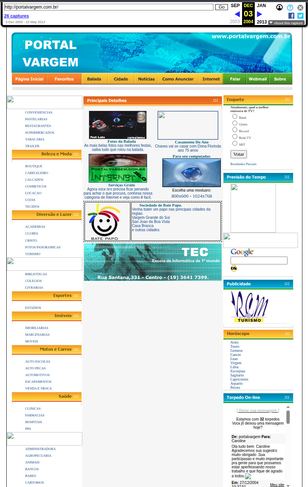

# Portal Vargem - A História da Intelmib (2003)

## 📖 A História

Em **2001**, ainda jovem, comecei a fazer sites pessoais - "coisa de moleque". Dois anos depois, em **2003**, resolvi transformar essa paixão em negócio.

### Como tudo começou:
- Criei o **Portal da Cidade (Portal Vargem)** para divulgar a região
- Comecei a desenvolver sites para terceiros
- Iniciei cobertura de eventos com fotografias
- Fotografei o comércio local
- O projeto começou a crescer e ganhar visibilidade

### A Estratégia:
- Vendi algumas publicidades dentro do site
- Como era eu quem criava os sites, fundei uma agência
- Escolhi o nome **Intelmib** para a empresa
- A ideia era que o site divulgasse a empresa Intelmib
- Criei seções inspiradas no modelo UOL da época:
  - Portal de notícias
  - Portal de baladas  
  - Diversas outras seções temáticas

### O Aprendizado:
Como era jovem e não entendia muito de marketing na época, o projeto não gerou o retorno financeiro esperado e acabei parando com essa iniciativa. Mas foi fundamental para o aprendizado e a evolução que levou ao **Intelmib** atual.

---

## 🌐 Portal Vargem - Arquivo Histórico

**URL Original**: https://web.archive.org/web/20041203013013/http://portalvargem.com.br/

Em 2003 não existia Google Maps, tudo era mais escasso. A moda da época eram os "torpedos" nos sites - uma espécie de fórum aberto onde as pessoas podiam deixar mensagens. e tambem pesquisar google dominavam

---

## 🧭 Menu principal — Links/Serviços

As seções principais exibidas no menu do portal eram:

- Bate Papo (on-line)
- Classificados - Grátis
- Eventos e Festas
- Fórum
- Mapas
- Principal

Esses links formavam a navegação central do Portal Vargem, orientando o usuário para os recursos mais acessados e interativos do site.

---

## 📂 Estrutura do Portal - Categorias

O Portal Vargem era organizado em diversas categorias para facilitar a navegação dos usuários da região:

### 🍽️ **Alimentação & Conveniência**
- Conveniências
- Pastelarias  
- Restaurantes
- Supermercados
- Tabacaria
- Trailer

### 👗 **Moda & Beleza**
- Boutique
- Cabeleleiro
- Calçados
- Cosméticos
- Locação
- Lojas
- Tecidos

### 🏃 **Esporte & Lazer**
- Academias
- Clubes
- Cristo
- Fotos Panorâmicas
- Turismo

### 🎓 **Educação**
- Bibliotecas
- Colégios
- Livrarias

### ⚽ **Esportes**
- Estádios

### 🏠 **Casa & Construção**
- Imobiliárias
- Marcenarias
- Móveis

### 🚗 **Automotivo**
- Auto Escolas
- Auto Peças
- Automotivos
- Escapamentos
- Venda e Troca

### 🏥 **Saúde**
- Clínicas
- Farmácias
- Hospitais
- PPA

### 🏢 **Serviços & Empresas**
- Administradora
- Agropecuária
- Animais
- Bancos
- Bares
- Cartórios
- Casa
- Celulares
- Ciretran
- Colchões
- Contabilidade
- Correios
- Delegacias
- Dentistas
- Depósitos
- Despachante
- Eletrônica
- Fórum
- Gráficas
- Igrejas
- Informática
- Jornais
- Lava Rápido
- Locação
- Lojas
- Lotéricas
- Materiais p/ Construção
- Papelarias
- Pesca
- Postos
- Prefeitura Municipal
- Refrigeração
- Relojoarias
- Rodoviária
- Segurança
- Sorveterias
- Telesp

---

### 🏦 Exemplo de listagem — Bancos

Cada estabelecimento exibido no portal apresentava endereço (rua e número), telefone e múltiplas fotos reais da área externa do local, para reforçar confiança e dar referência visual.

**Banco Banespa/Santander**  
Pça Cap: João P. Fontão, 130 - 3641 9200  
Veja Fotos

**Banco Bradesco**  
Pça Cap: João P. Fontão, 45 - 3641 4600/5277/2484  
Veja Fotos

**Banco do Brasil**  
Pça Cap: João P. Fontão, 145 - 3641 5444  
Veja Fotos

**Banco HSBC**  
Pça Cap.: João P. Fontão, 120 - 3641 1929/1464  
Veja Fotos

**Banco Itaú**  
Pça Cap: João P. Fontão, 81 - 3641 1174  
Veja Fotos

**Banco do Povo**  
Sob consulta  
Veja Fotos

**Caixa Econômica Federal**  
Pça Cap: João P. Fontão, 66 - 3641 5411/5433/4822  
Veja Fotos

---

## 🌟 **Seções Especiais & Utilidades**

### 👥 **Comunidade & Social**
- Amigos Virtuais
- Fome Zero
- Ajuda Brasil

### 🗺️ **Navegação & Mapas**
- Guia de Ruas
- Mapas

### 📺 **Entretenimento**
- Novelas
- Culinária

### ⚖️ **Serviços Públicos & Direitos**
- Leis e Direitos
- Lotéricas
- Sitegra-ICMS
- Secretaria Fazenda SP

### 👫 **Lifestyle**
- Homem
- Mulher
- Moda

### 📚 **Ferramentas & Referência**
- Tradutor
- Enciclopédia
- Dicionário
- Imposto de Renda
- CEP
- IPVA
- Seguro Obrigatório

### 🎯 **Serviços Diversos**
- Esportes
- Classificados
- Auxílio à Lista
- Previsão do Tempo
- Canal do Tempo
- Consulados
- Vestibular
- Horóscopo
- Cartões Virtuais
- Veículos
- Academia
- Agência de Modelos
- Turismo
- OAB
- Empresas Aéreas
- Hora Certa
- Perfumes
- Saúde

### 🎪 **Destaques Especiais**
- Chama Atenção
- Guia São João
- Guia Rio Pardo

---

## 📰 Destaque no Guia de Mídia

Na época, o Portal Vargem foi destaque no Guia de Mídia — um site que ranqueava os melhores portais e guias da internet. Ficamos uma semana na capa, reconhecidos pela inovação de apresentar cidades e comércios como um guia on-line com fotos reais.

---

## 📧 **Newsletter & Cadastro**

**Cadastre-se para receber novidades!**

> Para remover seu email de nosso serviço de newsletter, basta nos mandar um email com o título 'Remover Email' e colocar o endereço de seu email.

---

## 🎉 **Seções Interativas**

### 🌃 **Noite Brasileira - SBB**
As mais belas fotos nas melhores festas, saiba tudo que rolou na balada.

### 🤖 **Tecnologia em Ação**
Conheça Gabriela, a mestiça virtual que fala tudo que você digitar.

### 💻 **Serviços Grátis**
Agora você não precisa ficar penando para achar o que procura, conheça nossa categoria de Internet e veja como é fácil. Para seu computador.

**Escolha uma resolução:**
- 800x600 
- 1024x768

### 💬 **Sociedade de Bate Papo**
Venha bater um papo nas principais cidades da região:
- Vargem Grande do Sul
- São João da Boa Vista  
- Casa Branca
- E outras cidades

### 📺 **Enquete: Melhor Emissora de TV**
- Band
- Globo
- Record
- Rede TV
- SBT

### ♈ **Horóscopo**
- Áries
- Touro  
- Gêmeos
- Câncer
- Leão
- Virgem
- Libra
- Escorpião
- Sagitário
- Capricórnio
- Aquário
- Peixes

---

## 🏷️ **Créditos**

**PortalVargem.com.br © All rights reserved**  
*On-line desde 06/11/03*  
**Desenvolvido por: Intelmib.Net**